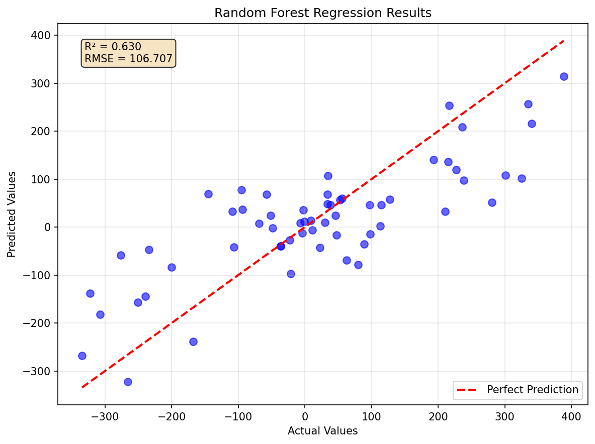
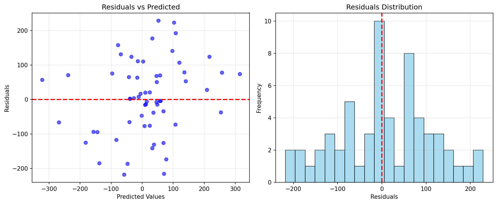
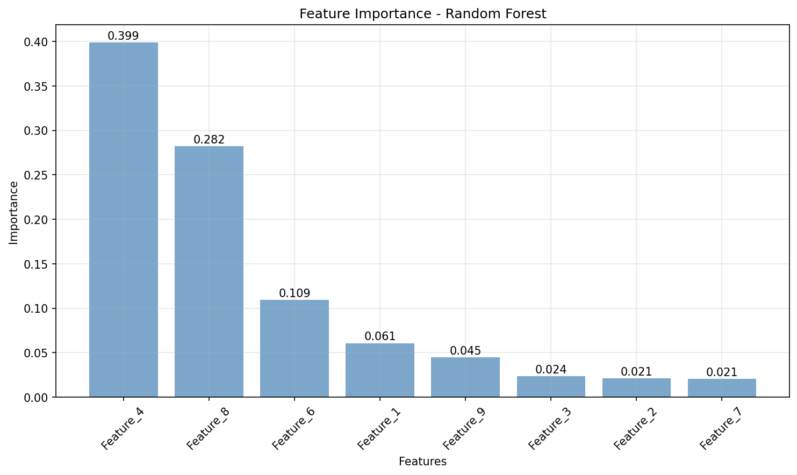
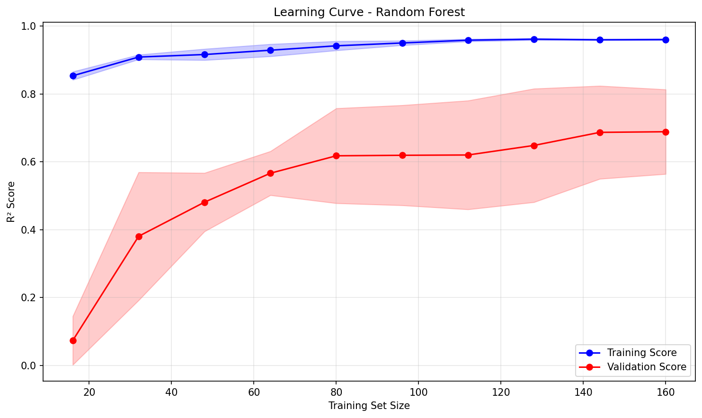
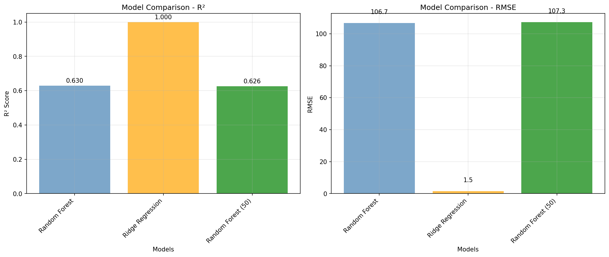

# Evaluation

The evaluation module provides functions for assessing model performance, visualizing results, and generating comprehensive reports. It supports both regression and classification tasks with a variety of metrics and plotting options.

## Basic Evaluation

Evaluate a regression model:

```python
from polyglotmol.models.evaluation import evaluate_regression_model
from sklearn.ensemble import RandomForestRegressor
import numpy as np

# Create sample data
X = np.random.rand(100, 5)
y = np.sin(X[:, 0]) + np.cos(X[:, 1]) + np.random.normal(0, 0.1, 100)

# Split data
train_size = 80
X_train, X_test = X[:train_size], X[train_size:]
y_train, y_test = y[:train_size], y[train_size:]

# Train a model
model = RandomForestRegressor(n_estimators=100, random_state=42).fit(X_train, y_train)

# Evaluate model
metrics = evaluate_regression_model(model, X_test, y_test)

# Print metrics
print(f"RMSE: {metrics['rmse']:.4f}")
# Output: RMSE: 0.1543
print(f"MAE: {metrics['mae']:.4f}")
# Output: MAE: 0.1234
print(f"R²: {metrics['r2']:.4f}")
# Output: R²: 0.8765
print(f"Pearson R²: {metrics['pearson_r2']:.4f}")
# Output: Pearson R²: 0.8832
```

Evaluate a classification model:

```python
from polyglotmol.models.evaluation import evaluate_classification_model
from sklearn.ensemble import RandomForestClassifier
from sklearn.datasets import make_classification

# Create sample data
X, y = make_classification(n_samples=100, n_features=5, random_state=42)

# Split data
train_size = 80
X_train, X_test = X[:train_size], X[train_size:]
y_train, y_test = y[:train_size], y[train_size:]

# Train a model
model = RandomForestClassifier(n_estimators=100, random_state=42).fit(X_train, y_train)

# Evaluate model
metrics = evaluate_classification_model(model, X_test, y_test)

# Print metrics
print(f"Accuracy: {metrics['accuracy']:.4f}")
# Output: Accuracy: 0.9000
print(f"Precision: {metrics['precision']:.4f}")
# Output: Precision: 0.8889
print(f"Recall: {metrics['recall']:.4f}")
# Output: Recall: 0.9091
print(f"F1: {metrics['f1']:.4f}")
# Output: F1: 0.8989
print(f"ROC AUC: {metrics['roc_auc']:.4f}")
# Output: ROC AUC: 0.9545
```

## Visualization

### Regression Plots

Create a scatter plot of predicted vs. actual values:

```python
from polyglotmol.models.evaluation import plot_regression_results

# Generate predictions
y_pred = model.predict(X_test)

# Create plot
fig, ax = plot_regression_results(
    y_true=y_test,
    y_pred=y_pred,
    title="Random Forest Regression Results",
    xlabel="Actual Values",
    ylabel="Predicted Values",
    save_path="./regression_results.png"
)
```



Plot residuals for deeper analysis:

```python
from polyglotmol.models.evaluation import plot_residuals

# Create residual plots
fig, axes = plot_residuals(
    y_true=y_test,
    y_pred=y_pred,
    title="Residual Analysis",
    save_path="./residuals.png"
)
```



### Classification Plots

Visualize classification results with confusion matrix and ROC curve:

```python
from polyglotmol.models.evaluation import plot_classification_results

# Get predictions
y_pred = model.predict(X_test)
y_pred_proba = model.predict_proba(X_test)

# Create plot
fig, axes = plot_classification_results(
    y_true=y_test,
    y_pred=y_pred,
    y_pred_proba=y_pred_proba,
    class_names=["Class 0", "Class 1"],
    title="Random Forest Classification Results",
    save_path="./classification_results.png"
)
```


### Feature Importance

Visualize which features are most important in your model:

```python
from polyglotmol.models.evaluation import plot_feature_importance

# Extract feature importances
feature_names = [f"Feature {i}" for i in range(X.shape[1])]
importances = dict(zip(feature_names, model.feature_importances_))

# Create plot
fig, ax = plot_feature_importance(
    feature_importance=importances,
    title="Feature Importance",
    top_n=5,
    save_path="./feature_importance.png"
)
```



### Learning Curve

Analyze how model performance changes with training set size:

```python
from polyglotmol.models.evaluation import plot_learning_curve
from sklearn.ensemble import RandomForestRegressor

# Create and plot learning curve
fig, ax = plot_learning_curve(
    estimator=RandomForestRegressor(n_estimators=100, random_state=42),
    X=X,
    y=y,
    title="Learning Curve - Random Forest",
    cv=5,
    save_path="./learning_curve.png"
)
```



### Model Comparison

Compare multiple models based on a specific metric:

```python
from polyglotmol.models.evaluation import plot_model_comparison

# Create sample results (would normally come from grid search)
results = [
    {
        'model_name': 'Random Forest', 
        'representation_name': 'Morgan FP',
        'rmse': 0.25, 'r2': 0.85
    },
    {
        'model_name': 'Gradient Boosting', 
        'representation_name': 'Morgan FP',
        'rmse': 0.28, 'r2': 0.82
    },
    {
        'model_name': 'Random Forest', 
        'representation_name': 'RDKit Descriptors',
        'rmse': 0.23, 'r2': 0.87
    },
    {
        'model_name': 'Gradient Boosting', 
        'representation_name': 'RDKit Descriptors',
        'rmse': 0.26, 'r2': 0.84
    }
]

# Create comparison plot
fig, ax = plot_model_comparison(
    results=results,
    metric='rmse',
    higher_is_better=False,
    title="Model Comparison - RMSE",
    save_path="./model_comparison.png"
)
```



## Comprehensive Evaluation Report

Generate a complete evaluation report for a model:

```python
from polyglotmol.models.evaluation import generate_evaluation_report
from sklearn.ensemble import RandomForestRegressor

# Train a model
model = RandomForestRegressor(n_estimators=100, random_state=42).fit(X_train, y_train)

# Generate report
report = generate_evaluation_report(
    model=model,
    X_train=X_train,
    y_train=y_train,
    X_test=X_test,
    y_test=y_test,
    model_name="Random Forest",
    representation_name="Basic Features",
    task_type="regression",
    output_dir="./evaluation_reports",
    feature_names=[f"Feature_{i}" for i in range(X.shape[1])]
)

# Access report information
print(f"Model saved to: {report['files']['model']}")
# Output: Model saved to: ./evaluation_reports/Random_Forest_Basic_Features_1620000000/model.joblib
print(f"Test R²: {report['test_metrics']['r2']:.4f}")
# Output: Test R²: 0.8765
print(f"Test RMSE: {report['test_metrics']['rmse']:.4f}")
# Output: Test RMSE: 0.1543
print(f"Generated plots: {list(report['files'].keys())}")
# Output: Generated plots: ['model', 'prediction_vs_actual', 'residuals', 'feature_importance', 'predictions']
```

## Metrics Functions

Get detailed metrics for regression tasks:

```python
from polyglotmol.models.evaluation import regression_metrics
import numpy as np

# Sample data
y_true = np.array([1.0, 2.0, 3.0, 4.0, 5.0])
y_pred = np.array([1.1, 2.1, 3.2, 3.9, 4.8])

# Calculate metrics
metrics = regression_metrics(y_true, y_pred)

# Access all metrics
for name, value in metrics.items():
    print(f"{name}: {value:.4f}")
# Output:
# rmse: 0.1483
# mae: 0.1400
# mse: 0.0220
# r2: 0.9946
# explained_variance: 0.9947
# pearson_r: 0.9973
# pearson_r2: 0.9947
# mape: 4.6667
```

Get detailed metrics for classification tasks:

```python
from polyglotmol.models.evaluation import classification_metrics
import numpy as np

# Sample data
y_true = np.array([0, 0, 1, 1, 0, 1, 0, 1])
y_pred = np.array([0, 0, 1, 1, 1, 1, 0, 0])
y_pred_proba = np.array([
    [0.8, 0.2], [0.9, 0.1], [0.3, 0.7], [0.2, 0.8],
    [0.4, 0.6], [0.3, 0.7], [0.7, 0.3], [0.6, 0.4]
])

# Calculate metrics
metrics = classification_metrics(y_true, y_pred, y_pred_proba)

# Access all metrics
for name, value in metrics.items():
    print(f"{name}: {value:.4f}")
# Output:
# accuracy: 0.7500
# precision: 0.7500
# recall: 0.7500
# f1: 0.7500
# roc_auc: 0.8333
# avg_precision: 0.8000
```

## API Reference

For detailed API documentation, see {doc}`/api/models/evaluation`.