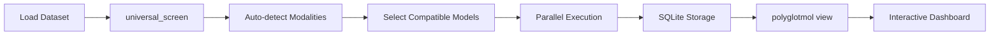

# Machine Learning Models

PolyglotMol provides intelligent automated machine learning for molecular property prediction with multimodal support, comprehensive model screening, and interactive result visualization.

## Overview

The models module automates the entire ML pipeline from data preprocessing to model deployment:

- **Automatic Screening**: Test model-representation combinations across multiple modalities
- **28 ML Models**: From linear regression to deep neural networks
- **Multi-Modal Support**: VECTOR, STRING, MATRIX, IMAGE data types
- **SQLite Storage**: Incremental result saving with crash recovery
- **Interactive Dashboard**: Professional visualization with `polyglotmol view`

## Quick Start

### One-Command Screening

```python
from polyglotmol.data import MolecularDataset
from polyglotmol.models.api import universal_screen

# Load dataset
dataset = MolecularDataset.from_csv(
    "molecules.csv",
    input_column="SMILES",
    label_columns=["activity"]
)

# Universal screening across all modalities
results = universal_screen(
    dataset=dataset,
    target_column="activity",
    task_type="regression"
)

# View results interactively
# polyglotmol view ./results_folder
```

### Access Best Model

```python
# Get best performing model
best_model = results['best_model']
print(f"Model: {best_model['model_name']}")
print(f"Representation: {best_model['representation_name']}")
print(f"R²: {best_model['metrics']['r2']:.3f}")

# Make predictions
predictions = best_model['estimator'].predict(new_data)
```

## Key Features

::::{grid} 1 1 2 3
:gutter: 3

:::{grid-item-card} 🚀 **Screening Functions**
:link: screening
:link-type: doc
Complete function reference for universal_screen, quick_screen, and more
:::

:::{grid-item-card} 🤖 **Available Models**
:link: models
:link-type: doc
28 models from linear regression to deep learning with parameter grids
:::

:::{grid-item-card} 💾 **Working with Results**
:link: results
:link-type: doc
SQLite database access, export options, and dashboard visualization
:::

:::{grid-item-card} 📊 **Evaluation Methodology**
:link: methodology
:link-type: doc
Data splitting, cross-validation protocol, and metrics explained
:::

::::

## Supported Input Modalities

PolyglotMol automatically detects and processes five data modalities:

| **Modality** | **Data Types** | **Compatible Models** | **Example** |
|-------------|---------------|----------------------|------------|
| **VECTOR** | Fingerprints, descriptors, embeddings | Traditional ML (RF, XGBoost, SVM) + VAE | `morgan_fp_r2_1024`, `rdkit_descriptors`, `chemberta_embeddings` |
| **STRING** | Raw molecular strings | Transformers | `canonical_smiles`, `selfies` |
| **MATRIX** | 2D arrays | CNN | `adjacency_matrix`, `coulomb_matrix` |
| **IMAGE** | Molecular images | CNN | `2d_image`, `3d_conformer_image` |
| **LANGUAGE_MODEL** | Pre-computed embeddings | Traditional ML | `chemberta`, `molformer`, `selformer` |

```{admonition} Automatic Detection
:class: tip
You don't need to specify modalities manually. PolyglotMol automatically detects available modalities from your dataset and selects compatible models.
```

## Workflow Overview



**Typical Workflow:**
1. Load molecular dataset with `MolecularDataset`
2. Run `universal_screen()` with target column
3. Results automatically saved to SQLite database
4. Launch dashboard: `polyglotmol view results_folder`
5. Explore performance, select best model
6. Export model for production use

## Task Types

### Regression

Predict continuous molecular properties:

```python
results = universal_screen(
    dataset=dataset,
    target_column="logP",
    task_type="regression",
    primary_metric="r2"  # Options: r2, rmse, mae, pearson_r
)
```

**Common Applications:** logP, solubility, binding affinity, toxicity scores

### Classification

Predict categorical outcomes:

```python
results = universal_screen(
    dataset=dataset,
    target_column="active",
    task_type="classification",
    primary_metric="f1"  # Options: f1, accuracy, roc_auc
)
```

**Common Applications:** Drug-likeness, bioactivity, ADMET classification

## Performance Comparison

| **Screening Mode** | **Models Tested** | **Time** | **When to Use** |
|-------------------|------------------|---------|----------------|
| `quick_screen()` | 5-10 essential models | 2-5 min | Initial exploration, small datasets (<1K molecules) |
| `universal_screen()` (auto) | 15-20 compatible models | 10-30 min | Standard screening, balanced performance |
| `universal_screen()` (comprehensive) | 25-30 all models + backups | 30-60 min | Final model selection, publication-quality |

```{admonition} Resource Management
:class: note
PolyglotMol intelligently manages CPU/GPU resources:
- **LIGHT tasks** (fingerprints + ML): Parallel combinations across all cores
- **HEAVY tasks** (CNN, Transformers): Sequential with internal parallelism
```

## Example: Complete Pipeline

```python
from polyglotmol.data import MolecularDataset
from polyglotmol.models.api import universal_screen
import pandas as pd

# 1. Prepare data
df = pd.read_csv("hiv_inhibitors.csv")
dataset = MolecularDataset.from_csv(
    "hiv_inhibitors.csv",
    input_column="SMILES",
    label_columns=["IC50"]
)

# 2. Run comprehensive screening
results = universal_screen(
    dataset=dataset,
    target_column="IC50",
    task_type="regression",
    combinations="auto",  # Automatic model selection
    enable_db_storage=True,  # Save to SQLite
    max_cpu_cores=-1  # Use all available cores
)

# 3. Quick performance check
print(f"Best R²: {results['best_score']:.3f}")
print(f"Models tested: {results['n_models_evaluated']}")
print(f"Results saved to: {results['database_path']}")

# 4. Launch interactive dashboard
# $ polyglotmol view ./screening_results.db

# 5. Export best model
best_estimator = results['best_estimator']
import joblib
joblib.dump(best_estimator, 'production_model.pkl')
```

## Next Steps

::::{grid} 1 1 2 2
:gutter: 2

:::{grid-item-card}
**→ Learn about screening functions**
{doc}`screening` - Complete API reference for all screening modes
:::

:::{grid-item-card}
**→ Explore available models**
{doc}`models` - 28 models with parameter grids and compatibility
:::

:::{grid-item-card}
**→ Understand evaluation methods**
{doc}`methodology` - Data splitting, cross-validation, and metrics
:::

:::{grid-item-card}
**→ Work with results**
{doc}`results` - SQLite access, exports, and caching
:::

:::{grid-item-card}
**→ Visualize with dashboard**
{doc}`../dashboard/index` - Interactive result exploration
:::

::::

## Common Questions

**Q: Which screening function should I use?**
A: Start with `universal_screen()` with `combinations="auto"`. It provides the best balance of coverage and speed.

**Q: How do I choose between models?**
A: The dashboard shows performance comparisons. Consider: (1) Predictive accuracy (2) Training speed (3) Interpretability (4) Deployment requirements.

**Q: Can I resume interrupted screenings?**
A: Yes! With `enable_db_storage=True`, PolyglotMol automatically caches results and skips completed combinations.

**Q: How do I use custom models?**
A: See {doc}`screening` for `combinations` parameter - you can pass custom model lists or Combination objects.

**Q: What if my dataset is very large (>100K molecules)?**
A: Use `quick_screen()` first to identify promising representation families, then run `universal_screen()` on selected types only.

```{toctree}
:maxdepth: 1
:hidden:

screening
models
results
methodology
```

## Additional Resources

- **API Reference**: {doc}`/api/models/index` - Detailed API documentation
- **Dashboard Guide**: {doc}`../dashboard/index` - Full dashboard features
- **Examples**: Check `examples/models/` in the repository
